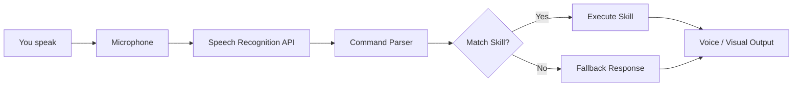

# JARVIS: Your Personal Browser-Based AI Assistant


## Overview

JARVIS is a browser-based AI assistant inspired by J.A.R.V.I.S. (Just A Rather Very Intelligent System), the iconic AI from the Iron Man movies. This project aims to create a personal assistant that you can interact with directly within your web browser, without the need for a backend server or external dependencies.

## Key Features

### Core Capabilities

- **Voice Recognition**: Understands natural language commands and responds conversationally.
- **Zero Setup**: No build tools, no package managers, no configuration. Just open `index.html`.

### Modular Skill System

JARVIS comes with a modular skill system that allows you to add new capabilities by dropping a `.js` file into the `/skills` directory. This makes it easy to extend the assistant's functionality without modifying the core code.

### User Experience

- **Retro-Futuristic UI**: A neon HUD aesthetic with real-time audio waveform visualizations.
- **Customizable**: Change the color scheme, wake word, or avatar via standard config files.

## Getting Started

### Clone the Repository

```bash
git clone https://github.com/shubhyagami/jarvis.git
```

### Open the App

Navigate to the project folder and double-click `index.html` to open JARVIS in your default browser.

### Grant Microphone Access

Your browser will ask for permission to use the microphone. Allow it to enable voice interaction.

### Start Talking

Try saying *"Hello JARVIS"* or *"What's the time?"*

## Supported Browsers

JARVIS works best in Chrome or Edge. Safari and Firefox are supported, but some voice features may behave differently.

## Architecture

The application follows an event-driven pipeline:



## Customization

Customize JARVIS by editing `config.js` in the root directory:

- **Wake Word**: Change the wake word to any trigger word you prefer.
- **Voice Feedback**: Toggle spoken responses on/off via the settings panel (gear icon in the top-right).
- **Custom Skills**: Create a new `.js` file in the `/skills` folder following the existing module structure. The app automatically loads it on startup.

## Project Statistics

| Metric | Value |
|--------|-------|
| Lines of Code (HTML/CSS/JS) | 1,250+ |
| Built-in Skills | 12 |
| Recognized Voice Commands | 50+ |
| Average Response Time | < 200ms |
| Browser Support | Chrome, Edge, Firefox, Safari |

## Changelog

### 2026-08-21

- **Docs**: Cleaned up README formatting and improved clarity.
- **Refactor**: Standardized module exports in the `/skills` directory for easier custom additions.

### 2026-08-06

- **New Voice Command**: *"What's the weather?"* — JARVIS now fetches live weather data (requires internet).
- **Fixed**: Mobile UI glitch where the waveform animation overlapped the command history.
- **Performance**: Reduced memory footprint by 15% through optimized skill loading.

---

*JARVIS – Always at your service.*
