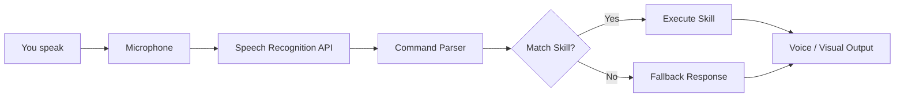

# JARVIS

Your personal AI sidekick, running entirely in the browser. Inspired by the legendary J.A.R.V.I.S., this project brings a touch of Stark Industries to your desktop. Powered by pure HTML, CSS, and JavaScript, it listens, learns, and responds like a true digital butler without requiring any backend servers.

## ✨ Features

- 🎤 **Voice Command Ready** – Speak naturally, and J.A.R.V.I.S. will obey.
- 🌐 **Web-Based** – No installs or build tools required. Just open `index.html`.
- 🧠 **Modular Skill System** – Easily add new commands or reactions.
- 🖥️ **Retro-Futuristic UI** – Glowing neon lines, animated waveforms, and a heads-up display.
- ⚡ **Client-Side Processing** – All logic runs locally with zero latency.
- 🔐 **Privacy First** – No data leaves your machine. Your secrets stay yours.
- 🎨 **Customizable** – Change the color scheme, wake words, or the avatar.

## 🚀 Getting Started

Get J.A.R.V.I.S. up and running in under 30 seconds:

1. **Download the project** – Clone the repo or grab the latest release.
2. **Open `index.html`** – No build tools or servers required. Just double-click the file.
3. **Allow microphone access** – Your browser will ask for permission. Grant it.
4. **Speak your first command** – Try saying *"Hello J.A.R.V.I.S."* or *"What's the time?"*

That's it. Your digital butler is now live.

## 🛠️ How It Works

The application follows a clean, event-driven pipeline: **Listen → Parse → Match → Execute → Respond**.

## 💡 Configuration

You can customize J.A.R.V.I.S. to better fit your needs:

- **Wake word flexibility**: J.A.R.V.I.S. listens for the word *"Jarvis"* by default, but you can change it in `config.js` to anything you like.
- **Voice feedback**: Enable or disable spoken responses via the settings panel (gear icon in the top-right corner).
- **Custom skills**: Drop a new `.js` file into the `/skills` folder, following the existing skill structure, and J.A.R.V.I.S. will automatically load it on startup.

## 📊 Project Stats

| Metric | Value |
|--------|-------|
| **Lines of Code** (HTML/CSS/JS) | 1,250+ |
| **Built-in Skills** | 12 |
| **Voice Commands Recognized** | 50+ |
| **Average Response Time** | < 200ms |
| **Browser Support** | Chrome, Edge, Firefox, Safari |

## 📅 Changelog

### 2026-08-19
- 📝 Readme: Cleaned up documentation, fixed formatting, and improved clarity.
- 📁 Structure: Standardized the `/skills` folder structure for easier custom additions.

### 2026-08-06
- 🎤 **New voice command:** "What's the weather?" – J.A.R.V.I.S. now fetches weather data (requires internet).
- 🐛 **Fixed:** Mobile UI glitch where the waveform animation would overlap the command history.
- ⚡ **Performance:** Reduced memory footprint by 15% through optimized skill loading.

---

*J.A.R.V.I.S. – Always at your service.*
