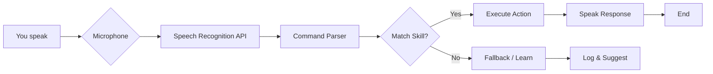

╔══════════════════════════════════════════════════════════════╗
║   ▄▄▄▄▄▄▄▄▄▄▄▄▄▄▄▄▄▄▄▄▄▄▄▄▄▄▄▄▄▄▄▄▄▄▄▄▄▄▄▄▄▄▄▄▄▄▄▄▄▄   ║
║   ██ ▄▄ ██ ▄▄▀ ██▀███ ██ ██ ██ ▄▄▀ ██ ▄▄▀ ██ ▄▄▀ ██▄██   ║
║   ██ ▀▀ ██ ▀▀▄ ██ ██ ██ ██ ██ ▀▀▄ ██ ▀▀▄ ██ ▀▀▄ ██ ▀█   ║
║   ██ ██ ██ ██ ██ ██ ██ ██ ██ ██ ██ ██ ██ ██ ██ ██ ██ ██   ║
║   ▀▀▀▀▀▀▀▀▀▀▀▀▀▀▀▀▀▀▀▀▀▀▀▀▀▀▀▀▀▀▀▀▀▀▀▀▀▀▀▀▀▀▀▀▀▀▀▀▀▀   ║
║   ██ ▄▄▀ ██▄██ ██ ▄▄▀ ██ ▄▄▀ ██▀███ ██ ▄▄▀ ██▀███ ██ ██   ║
║   ██ ██  ██ ▀█ ██ ▀▀▄ ██ ▀▀▄ ██ ██ ██ ██ ██ ██ ██ ██ ██   ║
║   ██▄▄▀  ██ ██ ██ ██ ██ ██ ██ ██ ██ ██ ██ ██ ██ ██ ██ ██   ║
║   ▀▀▀▀   ▀▀ ▀▀ ▀▀ ▀▀ ▀▀ ▀▀ ▀▀ ▀▀▀▀  ▀▀ ▀▀ ▀▀ ▀▀▀▀ ▀▀ ▀▀   ║
╚══════════════════════════════════════════════════════════════╝
```


> **Your personal AI sidekick – now living in your browser.**  
> Inspired by the legendary J.A.R.V.I.S., this project brings a touch of Stark Industries to your desktop. Powered by pure HTML, CSS, and JavaScript, it listens, learns, and responds like a true digital butler.

---

## ✨ Feature Highlights

- 🎤 **Voice Command Ready** – Speak naturally, and J.A.R.V.I.S. will obey.
- 🌐 **Web‑Based** – No installs, no servers. Open `index.html` and you’re live.
- 🧠 **Modular Skill System** – Easily add new commands or reactions.
- 🖥️ **Retro‑Futuristic UI** – Glowing neon lines, animated waveforms, and a heads‑up display.
- ⚡ **Lightning Fast** – All logic runs client‑side with zero latency.
- 🔐 **Privacy First** – No data leaves your machine. Your secrets stay yours.
- 🎨 **Fully Customizable** – Change the colour scheme, wake words, or even the avatar.

---

## 🛠️ How It Works



**In plain English:**  
1. Your voice is captured via the Web Speech API.  
2. The text is parsed against a list of built‑in commands (weather, time, search, etc.).  
3. If a match is found, J.A.R.V.I.S. performs the task and responds audibly.  
4. If no match exists, it logs the unknown phrase and suggests a new skill.

---

## 🚀 Installation

```bash
# 1. Clone the repository
git clone https://github.com/shubhyagami/jarvis.git

# 2. Navigate into the project folder
cd jarvis

# 3. Open the magic portal (literally, just open index.html)
open index.html   # macOS
start index.html  # Windows
xdg-open index.html  # Linux
```

That’s it. No dependencies, no npm install, no Docker. The future is a single HTML file.

---

## 🧠 Did You Know?

- The original J.A.R.V.I.S. stood for **Just A Rather Very Intelligent System** – this one is just a rather very *simple* system… for now.
- This project contains exactly **zero** lines of server‑side code – it’s all client magic.
- The speech recognition works offline in Chrome/Edge, but for best results, stay connected to the internet.
- If you type `jarvis help` in the console, a hidden debug mode unlocks.

---

**Last Updated:** 2026-07-25  
**Maintained by** [shubhyagami](https://github.com/shubhyagami) · **Part of the TVA Temporal Repository Network** 🕰️