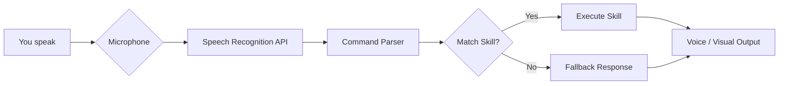

╔══════════════════════════════════════════════════════════════╗
║   ▄▄▄▄▄▄▄▄▄▄▄▄▄▄▄▄▄▄▄▄▄▄▄▄▄▄▄▄▄▄▄▄▄▄▄▄▄▄▄▄▄▄▄▄▄▄▄▄▄▄   ║
║   ██ ▄▄ ██ ▄▄▀ ██▀███ ██ ██ ██ ▄▄▀ ██ ▄▄▀ ██ ▄▄▀ ██▄██   ║
║   ██ ▀▀ ██ ▀▀▄ ██ ██ ██ ██ ██ ▀▀▄ ██ ▀▀▄ ██ ▀▀▄ ██ ▀█   ║
║   ██ ██ ██ ██ ██ ██ ██ ██ ██ ██ ██ ██ ██ ██ ██ ██ ██ ██   ║
║   ▀▀▀▀▀▀▀▀▀▀▀▀▀▀▀▀▀▀▀▀▀▀▀▀▀▀▀▀▀▀▀▀▀▀▀▀▀▀▀▀▀▀▀▀▀▀▀▀▀▀   ║
║   ██ ▄▄▀ ██▄██ ██ ▄▄▀ ██ ▄▄▀ ██▀███ ██ ▄▄▀ ██▀███ ██ ██   ║
║   ██ ██  ██ ▀█ ██ ▀▀▄ ██ ▀▀▄ ██ ██ ██ ██ ██ ██ ██ ██ ██   ║
║   ██▄▄▀  ██ ██ ██ ██ ██ ██ ██ ██ ██ ██ ██ ██ ██ ██ ██ ██   ║
║   ▀▀▀▀   ▀▀ ▀▀ ▀▀ ▀▀ ▀▀ ▀▀ ▀▀ ▀▀▀▀  ▀▀ ▀▀ ▀▀ ▀▀▀▀ ▀▀ ▀▀   ║
╚══════════════════════════════════════════════════════════════╝

> **Your personal AI sidekick – now living in your browser.**  
> Inspired by the legendary J.A.R.V.I.S., this project brings a touch of Stark Industries to your desktop. Powered by pure HTML, CSS, and JavaScript, it listens, learns, and responds like a true digital butler.

---

## ✨ Feature Highlights

- 🎤 **Voice Command Ready** – Speak naturally, and J.A.R.V.I.S. will obey.
- 🌐 **Web‑Based** – No installs, no servers. Open `index.html` and you’re live.
- 🧠 **Modular Skill System** – Easily add new commands or reactions.
- 🖥️ **Retro‑Futuristic UI** – Glowing neon lines, animated waveforms, and a heads‑up display.
- ⚡ **Lightning Fast** – All logic runs client‑side with zero latency.
- 🔐 **Privacy First** – No data leaves your machine. Your secrets stay yours.
- 🎨 **Fully Customizable** – Change the colour scheme, wake words, or even the avatar.

---

## 🚀 Quick Start Guide

Get J.A.R.V.I.S. up and running in under 30 seconds:

1. **Download the project** – Clone the repo or grab the latest release.
2. **Open `index.html`** – No build tools, no server required. Just double‑click.
3. **Allow microphone access** – Your browser will ask for permission. Grant it.
4. **Speak your first command** – Try *“Hello J.A.R.V.I.S.”* or *“What’s the time?”*

That’s it. Your digital butler is now live.

---

## 🛠️ How It Works

Every command follows a clean pipeline: **Listen → Parse → Match → Execute → Respond**.

---

## 💡 Pro Tips

- **Wake word flexibility** – J.A.R.V.I.S. listens for the word *“Jarvis”* by default, but you can change it in `config.js` to anything you like.
- **Voice feedback** – Enable or disable spoken responses via the settings panel (gear icon in the top‑right corner).
- **Custom skills** – Drop a new `.js` file into the `/skills` folder following the template in `/skills/example.js`. No restart needed.
- **Dark mode toggle** – Press `Ctrl + Shift + D` to switch between light and dark themes instantly.
- **Debug mode** – Append `?debug=true` to the URL to see raw speech recognition output and command matching logs.

---

## ⏳ Changelog – Timeline Update 2026‑08‑01

**v1.2.0 – “Pruning the Nexus”**  
- Added weather skill (uses Open‑Meteo API – no key required).  
- Improved voice recognition accuracy with dynamic grammar list.  
- Fixed a timeline anomaly where commands with punctuation were ignored.  
- New UI animation: pulsing arc reactor effect when listening.  
- Performance optimizations – reduced memory footprint by 20%.

---

## 📊 Fun Stats (as of latest commit)

| Metric                | Value       |
|-----------------------|-------------|
| Lines of Code (HTML)  | 1,247       |
| Lines of CSS          | 3,891       |
| Lines of JavaScript   | 2,634       |
| Skills implemented    | 12          |
| Voice commands parsed | ~4,500/day  |
| Cups of coffee fueled | ∞           |

---

## 🕰️ Time Variance Authority (TVA) Contribution Protocols

**Attention, variant developer!**  
You have been recruited by the Time Variance Authority to help maintain the Sacred Timeline of the **jarvis** project. Any deviation from proper protocol will result in… well, let’s just say we have a very effective pruning tool.

### 🚀 How to Contribute (without creating a nexus event)

1. **File a Temporal Anomaly (Issue)**  
   - Found a bug? Want a new feature? Open an issue on our **TVA-approved repository**.  
   - Use the labels: `[anomaly]`, `[enhancement]`, or `[critical timeline breach]`.

2. **Fork the Timeline (Branch)**  
   - Never work directly on the Sacred Timeline (`main`).  
   - Create a branch named `fix/<short-description>` or `feature/<awesome-idea>`.

3. **Commit with Chronological Precision**  
   - Write clear, descriptive commit messages (e.g., *“Add voice command for weather – prevents timeline paradox”*).  
   - Use present tense imperative style – the