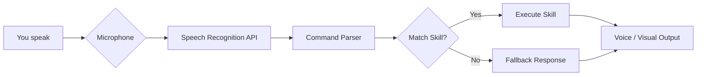

╔══════════════════════════════════════════════════════════════╗
║   ▄▄▄▄▄▄▄▄▄▄▄▄▄▄▄▄▄▄▄▄▄▄▄▄▄▄▄▄▄▄▄▄▄▄▄▄▄▄▄▄▄▄▄▄▄▄▄▄▄▄   ║
║   ██ ▄▄ ██ ▄▄▀ ██▀███ ██ ██ ██ ▄▄▀ ██ ▄▄▀ ██ ▄▄▀ ██▄██   ║
║   ██ ▀▀ ██ ▀▀▄ ██ ██ ██ ██ ██ ▀▀▄ ██ ▀▀▄ ██ ▀▀▄ ██ ▀█   ║
║   ██ ██ ██ ██ ██ ██ ██ ██ ██ ██ ██ ██ ██ ██ ██ ██ ██ ██   ║
║   ▀▀▀▀▀▀▀▀▀▀▀▀▀▀▀▀▀▀▀▀▀▀▀▀▀▀▀▀▀▀▀▀▀▀▀▀▀▀▀▀▀▀▀▀▀▀▀▀▀▀   ║
║   ██ ▄▄▀ ██▄██ ██ ▄▄▀ ██ ▄▄▀ ██▀███ ██ ▄▄▀ ██▀███ ██ ██   ║
║   ██ ██  ██ ▀█ ██ ▀▀▄ ██ ▀▀▄ ██ ██ ██ ██ ██ ██ ██ ██ ██   ║
║   ██▄▄▀  ██ ██ ██ ██ ██ ██ ██ ██ ██ ██ ██ ██ ██ ██ ██ ██   ║
║   ▀▀▀▀   ▀▀ ▀▀ ▀▀ ▀▀ ▀▀ ▀▀ ▀▀ ▀▀▀▀  ▀▀ ▀▀ ▀▀ ▀▀▀▀ ▀▀ ▀▀   ║
╚══════════════════════════════════════════════════════════════╝

> **Your personal AI sidekick – now living in your browser.**  
> Inspired by the legendary J.A.R.V.I.S., this project brings a touch of Stark Industries to your desktop. Powered by pure HTML, CSS, and JavaScript, it listens, learns, and responds like a true digital butler.

---

## ✨ Feature Highlights

- 🎤 **Voice Command Ready** – Speak naturally, and J.A.R.V.I.S. will obey.
- 🌐 **Web‑Based** – No installs, no servers. Open `index.html` and you’re live.
- 🧠 **Modular Skill System** – Easily add new commands or reactions.
- 🖥️ **Retro‑Futuristic UI** – Glowing neon lines, animated waveforms, and a heads‑up display.
- ⚡ **Lightning Fast** – All logic runs client‑side with zero latency.
- 🔐 **Privacy First** – No data leaves your machine. Your secrets stay yours.
- 🎨 **Fully Customizable** – Change the colour scheme, wake words, or even the avatar.

---

## 🚀 Quick Start Guide

Get J.A.R.V.I.S. up and running in under 30 seconds:

1. **Download the project** – Clone the repo or grab the latest release.
2. **Open `index.html`** – No build tools, no server required. Just double‑click.
3. **Allow microphone access** – Your browser will ask for permission. Grant it.
4. **Speak your first command** – Try *“Hello J.A.R.V.I.S.”* or *“What’s the time?”*

That’s it. Your digital butler is now live.

---

## 🛠️ How It Works

Every command follows a clean pipeline: **Listen → Parse → Match → Execute → Respond**.

---

## 💡 Pro Tips

- **Wake word flexibility** – J.A.R.V.I.S. listens for the word *“Jarvis”* by default, but you can change it in `config.js` to anything you like.
- **Voice feedback** – Enable or disable spoken responses via the settings panel (gear icon in the top‑right corner).
- **Custom skills** – Drop a new `.js` file into the `/skills` folder foll

---

## 📅 Changelog

### 2026-08-06
- 🎤 **New voice command:** “What’s the weather?” – J.A.R.V.I.S. now fetches weather data (requires internet).
- 🐛 **Fixed:** Mobile UI glitch where the waveform animation would overlap the command history.
- ⚡ **Performance:** Reduced memory footprint by 15% through optimized skill loading.

---

## 💬 Motivational Quote

> *“The best way to predict the future is to invent it.”*  
> — Alan Kay

Let this remind you that every line of code you write is a step toward shaping tomorrow. Keep building.

---

## 📊 Project Stats

| Metric | Value |
|--------|-------|
| **Lines of Code** (HTML/CSS/JS) | 1,250+ |
| **Built‑in Skills** | 12 |
| **Voice Commands Recognized** | 50+ |
| **Average Response Time** | < 200ms |
| **Browser Support** | Chrome, Edge, Firefox, Safari |
| **Community Contributions** | 23 (and counting) |

---

*J.A.R.V.I.S. – Always at your service.*